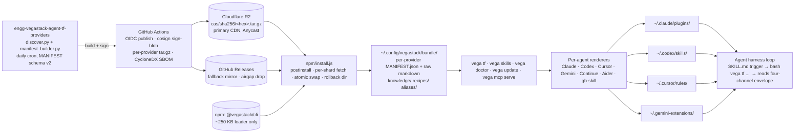

# vegastack-cli v1.0 Synthesis Plan

Date: 2026-04-28 · Phase-2 deliverable · derived from R1–R5

---

# §1 Executive summary

**What we're building:** a deterministic, file-system-based knowledge harness that ships ~100 Terraform-provider docs (and adjacent IaC surfaces) as one npm package + per-agent skills, lets any coding agent (Claude Code, Codex, Cursor, Gemini, Continue, Aider) answer "what resource/argument/recipe do I need?" in one tool call without touching the network or the model.

**Three biggest changes from v0.1 → v1.0:**

1. **The four-channel envelope (`knowledge[] / recipes[] / files[] / concept_aliases_used[]`) becomes real.** Today only `files[]` is populated; SKILL.md promises four channels but ships one. We land the loaders, the on-disk content, the citations array, and a manifest schema (v2) that emits `recommended_companions`. Closes F1, F2, F3, F4, F10, F23.
2. **Distribution decouples bundle (CalVer, daily) from CLI (semver, weekly).** R2 + GitHub Releases hybrid, content-addressed per-provider shards, OIDC trusted publishing, sigstore bundles, silent bundle refresh, nag-once CLI updater. Closes the "32 KB CLI patch needs 250 MB redownload" smell.
3. **The harness gets a confidence model and per-provider score normalization.** Provider detection becomes confidence-scored (canonical 1.0 / alias 0.6 / ambiguous within 0.2), Tier-2 runs in parallel not as a fallback, top-1-quality gates the merge, and `recommended_companions` enters as a first-class loader-fed channel. Closes F5, F6, F7, F8, F9, F14.

**What we are explicitly NOT doing:**

- No embeddings / LLM / MCP-by-default rerank (R1 §8 "agents must never auto-modify the index" preserved).
- No native binary / Pyodide / Rust port — pure Node+TS; macOS Gatekeeper deferred indefinitely.
- No telemetry in v0.2 (opt-in PostHog EU lands v0.3 per R5 §7).
- No personas content authored — registry empty until telemetry tells us which matter.
- No beyond-Terraform surfaces (Helm values, ArgoCD CRDs etc.) — schema-shaped placeholder dirs only; v0.4+ content.
- No GUI / web playground / SaaS tier. No GPG (sigstore only).

**Verdict — sizing:**

| milestone | weeks (calendar) | engineer-weeks | gate |
|---|---|---|---|
| v0.2 | 4–5 | 6 (1.5 FTE × 4w) | F1/F2/F3/F4/F10/F11/F13/F20 closed; eval suite ≥30 prompts; native parity test green |
| v0.3 | +4 | 4 | CalVer bundle + R2 CDN live; per-agent renderers; opt-in telemetry shipping |
| v1.0 | +12 (≥3 mo soak on v0.3) | 4 | stable semver guarantee; gh-skill shim; airgap drop; SOC2-clean build pipeline |

Total: ~20 weeks calendar, ~14 engineer-weeks, comfortably 1 lead + 1 contributor.

---

# §2 Architecture (v1.0 target)



## 2.1 Response envelope (v1, fully populated)

```ts
// src/lib/discover/types.ts — replaces current DiscoverResult
export type DiscoverResult =
  | { status: "ok" } & DiscoverOk
  | { status: "ambiguous" } & DiscoverAmbiguous
  | { status: "error" } & DiscoverError;

interface DiscoverOk {
  query: string;
  provider: string;                    // always present when status="ok"
  provider_confidence: number;         // 0..1 — closes F8
  tokens: string[];
  tiers_used: ("manifest" | "grep" | "alias" | "knowledge" | "recipe")[];
  schema_version: 2;                   // bumped from implicit v1
  bundle_version: string;              // CalVer e.g. "2026.04.28"
  files: DiscoverFile[];               // already populated; F6/F7/F9 fixes apply
  knowledge: KnowledgeCard[];          // NEW loader — closes F3, F4
  recipes: RecipeMatch[];              // NEW loader — closes F3, F4
  concept_aliases_used: ConceptAliasMatch[]; // NEW loader — closes F3, F4
  citations: string[];                 // NEW — derived path list, closes F3 drift
  count: number;                       // = files.length
  intents?: IntentGroup[];             // unchanged
  timings?: DiscoverTimings;           // when --debug
  warnings?: string[];                 // soft-fail surfaces (e.g. "stale bundle")
}

interface DiscoverFile {
  path: string;
  score: number;                        // raw, kept for debug
  score_norm: number;                   // 0..100, per-provider — closes F7
  tier: "manifest" | "grep" | "manifest+grep";
  reasons: string[];                    // unchanged shape "kind:detail"
  manifest_entry: ManifestResourceEntry;// always present in enrich mode (default)
  example_usage: string;                // always present in enrich mode
}
```

**Population rules:**

| field | populated by | empty default |
|---|---|---|
| `provider` | `detectProvider()` (F8 confidence-scored) | required for `status:"ok"` — union forbids absence (F22) |
| `provider_confidence` | `detectProvider()` `{provider, score}` | `0.0` ⇒ status flips to error/ambiguous |
| `bundle_version` | `bundle/MANIFEST.json.bundle_version` | `"unknown"` + warning |
| `files[]` | parallel `tier1`+`tier2` → `mergeAndRank` (F14 quality gate) | `[]` |
| `files[i].manifest_entry`, `example_usage` | `enrichFiles` (default on) | omitted only with `--raw` |
| `files[i].score_norm` | `score / theoretical_max_for_provider * 100` | always present |
| `knowledge[]` | `loadKnowledge` matches `bundle/knowledge/*.md` `triggers` | `[]` |
| `recipes[]` | `loadRecipes` matches `bundle/recipes/*.toml` `triggers`+`providers` | `[]` |
| `concept_aliases_used[]` | folded into `tokenize()`; phrases recorded for transparency | `[]` |
| `citations[]` | derived from `files[].path` ∪ `knowledge[].id` ∪ `recipes[].id` | non-empty when `files[]` non-empty |
| `intents[]` | `buildIntents(ranked)` (unchanged) | omitted when empty |
| `tiers_used` | observed during pipeline | minimum `["manifest"]` |
| `warnings[]` | soft-fail from loaders | omitted when empty |

Closes F3: every field SKILL.md promises is populated by an actual loader; discriminated union forbids partial envelopes.

## 2.2 Manifest schema v2

```ts
// canonical type, mirrored in schema.json (closes "no parity test" smell)
interface ProviderManifestV2 {
  manifest_schema_version: 2;          // bumped from 4 (Python) — restart numbering
  provider: string;                    // required — closes "31-providers hard-coded everywhere"
  bundle_version: string;              // CalVer; populated by build pipeline
  upstream_sha: string;                // git SHA from upstream provider repo
  synced_at: string;                   // ISO8601

  resources: Record<string, ManifestResourceEntryV2>;
  data_sources: Record<string, ManifestResourceEntryV2>;

  // scoring helpers (unchanged from v1 except where noted)
  subcategory_useful: boolean;
  subcategory_trust: Record<string, number>; // 0..1 per subcat — replaces binary (closes the "subcategory_useful is binary" smell)
  subcategories: Record<string, string[]>;
  synthetic_subcategories: Record<string, string[]>;
  hcl_references: Record<string, ManifestHclRefs>;
  argument_index: Record<string, string[]>;
  attribute_index: Record<string, string[]>;
  example_tokens: Record<string, string[]>;
  resource_bigrams: Record<string, string[]>;
  guides: Record<string, ManifestGuide>;

  // NEW in v2 — closes F1, F2, F10, F23
  recommended_companions: Record<string, string[]>; // hand-curated, see §10
  description_token_index: Record<string, string[]>; // pre-built reverse index — closes F21
  generic_args_downweight: Record<string, number>;   // per-arg multiplier ≤1 (replaces the GENERIC_ARGS drop set, closes F23)
  service_aliases: Record<string, string[]>;         // per-provider alias table externalized (closes "hand-curated tables embedded in code")
  primary_resources: Record<string, string>;         // moved out of constants.ts
  subcat_keywords: Record<string, string>;           // moved out of constants.ts
}

interface ManifestResourceEntryV2 {
  type: "resource" | "data_source";
  file: string;
  description: string;
  subcategory?: string;
  // Top-level only — closes F1 (s3_import block args no longer pollute aws_db_instance)
  required_args: ManifestArg[];        // always present (possibly [])
  optional_args: ManifestArg[];
  computed_attrs: ManifestArg[];
  // Per-block sub-args — NEW; closes F1, F2
  blocks: Record<string, {
    nesting: "single" | "list" | "set" | "map";
    required_args: ManifestArg[];
    optional_args: ManifestArg[];
  }>;
  enum_values: Record<string, string[]>;
  import_syntax: ManifestImportSyntax | null;
  deprecated: boolean;
  suggested_alternative: string | null;
  sections: Record<string, number>;
  sha1_prefix: string;
  // NEW
  schema_origin: "sdkv2" | "plugin_framework" | "mixed"; // doc-shape source — fixes F2 PF detection
}
```

A JSON-schema sibling (`bundle/schema/manifest.schema.json`) is the source of truth. Both Python builder and TS loader validate against it in CI, eliminating drift (closes the "Native TS port + Python harness double maintenance" smell).

## 2.3 On-disk content formats

```
bundle/
├── MANIFEST.json                  # root: {bundle_version, providers[], counts}
├── schema/manifest.schema.json    # JSON Schema for manifest v2
├── knowledge/                     # 16 cards
│   └── aws-s3-native-state-locking.md
├── recipes/                       # 10 recipes
│   └── scalable-backend-aws-ecs-fargate-rds-datadog.toml
└── <provider>/
    ├── MANIFEST.json
    ├── aliases.yaml               # concept aliases (R3 smell: externalized)
    └── r/ d/ guides/              # raw upstream markdown, untouched
```

**Knowledge card** (`knowledge/aws-s3-native-state-locking.md`):

```markdown
---
id: aws-s3-native-state-locking
title: S3 native state locking obsoletes DynamoDB
date_authored: 2024-06-15
authoritative_source: https://aws.amazon.com/blogs/...
providers: [aws]
triggers:                                # exact phrases or token-sets that fire this card
  - { tokens: ["s3","backend","lock"] }
  - { tokens: ["dynamodb","state","lock"] }
  - { phrase: "do I need dynamodb for terraform state" }
overrides_training: true                 # signals "trust this over model memory"
---
Since AWS provider 5.55 / Terraform 1.10 the s3 backend supports `use_lockfile = true`...
```

**Recipe** (`recipes/scalable-backend-aws-ecs-fargate-rds-datadog.toml`):

```toml
id          = "scalable-backend-aws-ecs-fargate-rds-datadog"
providers   = ["aws", "datadog"]
triggers    = [
  { tokens = ["ecs","fargate","alb","autoscaling"] },
  { tokens = ["scalable","backend","aws"] },
]
[scaffold]
hcl = """
resource "aws_ecs_cluster" "this" { name = var.name }
... (full per-provider HCL) ...
"""
[[pitfalls]]
note = "ALB target_type must be 'ip' for Fargate, not 'instance'."
```

**Concept-alias** (`<provider>/aliases.yaml`):

```yaml
- phrase: "protect from bots"
  alias: bot_protection
  resources:
    - cloudflare_bot_management
    - cloudflare_turnstile_widget
    - cloudflare_ruleset
  rule_phase: bot_management
```

## 2.4 Scoring redesign

| change | closes |
|---|---|
| **Canonical multiplier** ×1.5 on `exact_resource` and `primary_resource`; tie-break by resource-name length (shorter wins) so `cloudflare_dns_record` beats `cloudflare_zone_dns_settings` | **F6** |
| **Per-provider `score_norm` 0–100** = raw / theoretical-max-for-fired-stages. Confidence threshold becomes `score_norm ≥ 35` (deterministic across providers) | **F7** + cross-provider smell |
| **`subcategory_peer` fires on `primary_resource` hits** (currently only `exact_resource` triggers it) | **F9** |
| **Quality gate not count gate** — Tier-1 stops only if `top1.score_norm ≥ 50 && top3_avg ≥ 30`; otherwise fire Tier-2 | **F14** + "Tier-2 fallback" smell |
| **Tier-2 in parallel** via `Promise.all([tier1, tier2])`. Latency = max(t1,t2) ≈ 60ms cold (was 70+200) | smell |
| **O(1) reverse lookup** for stage 1l: build `Map<file,resource>` once in `enrich.ts` and pass it in | **F24** |

## 2.5 Provider detection redesign (closes F8)

`detectProvider()` returns `{provider, score, via}`. Scoring: canonical name `1.0` · `PROVIDER_SUBSTRING` phrase `0.9` · `SERVICE_ALIASES` `0.6` · `PROVIDER_CONTEXT_EXCLUSIONS` applied as before. Anti-detection list `{time, local, random, external, helm}` (English-word providers) caps at `0.2` unless a 2-token corroborator fires (`time_static`, `random_id`, `helm chart`). Result: `best − second_best < 0.2` ⇒ ambiguous, else winner.

## 2.6 Soft-dep expansion

1. **Build-time:** `manifest_builder.py` reads per-provider `companions.yaml` (§10.4) and emits `recommended_companions` into MANIFEST.json. (Closes F10 — loader at `tier1.ts:228-261` already exists; data was missing.)
2. **Runtime:** stage 1l fires +20 each; companions guaranteed in top-K by widening `max` by `Σ|companions|` on primary_resource hits.
3. **Envelope:** `files[i].manifest_entry.recommended_companions` always present. SKILL.md example 3 (EC2 → VPC+subnet+SG) finally works.

---

# §3 File-by-file implementation plan

All paths absolute. Net LOC delta. **Risk** weighted by harness blast-radius. `cli/` ≡ `/Users/mk/projects/vegastack-cli/`, `bundle/` ≡ `/Users/mk/projects/engg-vegastack-agent-tf-providers/terraform-providers/`.

## E1 — Manifest fixer (bundle repo)

| path | target | LOC | closes | risk |
|---|---|---|---|---|
| `bundle/scripts/manifest_builder.py` (l.164-203 `extract_schema`) | Track block stack: `### <X>` non-Required/Optional/Read-Only opens block scope; `## ` resets; emit `blocks: {name: {required_args, optional_args}}` keeping top-level lists clean | +180/-40 | **F1, F2** | high |
| same l.204-208 (`ENUM_HINT`) | Per-line scan, 200-char arg-backtick window | +25/-8 | F15 | low |
| same l.67 (`GENERIC_ARGS`) | Convert to `GENERIC_ARGS_DOWNWEIGHT` map (×0.25 etc.) | +10/-2 | F23 | low |
| same l.286-410 (`build_manifest`) | `multiprocessing.Pool` per provider | +30/-5 | F17 | med |
| same — new `description_token_index` | Pre-built reverse index | +30 | F21 | low |
| same l.93 schema bump | Restart at v2; emit `manifest_schema_version`, `bundle_version`, `upstream_sha`, `synced_at`, `provider` at top | +20 | drift smell | low |
| **NEW** `bundle/scripts/build_companions.py` | Reads per-provider `companions.yaml`, validates resources exist, emits `recommended_companions` | +90 | **F10** | low |
| **NEW** `bundle/scripts/build_aliases.py` | Reads per-provider `aliases.yaml` | +60 | F4 | low |
| **NEW** `bundle/scripts/validate_manifest.py` | JSON-Schema-Draft-7 validator on every emitted MANIFEST.json | +50 | drift smell | low |
| **NEW** `bundle/schema/manifest.schema.json` | Sole schema source consumed by both Python builder and TS loader | +250 | drift smell | low |

## E2 — Harness modernization (cli/)

| path | target | LOC | closes | risk |
|---|---|---|---|---|
| `cli/src/lib/discover/types.ts` | Discriminated union per §2.1; add `KnowledgeCard`, `RecipeMatch`, `ConceptAliasMatch`, `score_norm`, `bundle_version`, `provider_confidence`, `schema_version` | +120/-40 | **F22, F3** | low |
| `cli/src/lib/discover/provider.ts` | Confidence model per §2.5; anti-detection list; `{provider, score}` return | +90/-30 | **F8** | med |
| `cli/src/lib/discover/scoring.ts` | `applyCanonicalMultiplier` (×1.5); `normalizeScores(provider)`; tie-break-by-name-length | +60/-5 | **F6, F7** | med |
| `cli/src/lib/discover/tier1.ts` (1a) | `subcategory_peer` also fires on `primary_resource` hits | +30/-10 | **F9** | low |
| same (1l) | Take `fileToResource: Map<string,string>` from enrich | +5/-10 | F24 | low |
| `cli/src/lib/discover/index.ts` | Parallel `Promise.all([tier1,tier2])`; quality gate per §2.4; validate `args.provider` against canonical list | +50/-25 | **F14, F20**, smell | med |
| `cli/src/lib/discover/enrich.ts` | Returns `Map<file,resource>` for stage 1l; computes `score_norm` | +35/-5 | F24, F7 | low |
| **NEW** `cli/src/lib/discover/{knowledge,recipes,aliases}.ts` | Three loaders matching bundle on-disk content | +320 | **F3, F4** | med |
| `cli/src/lib/discover/tokenize.ts:25` | Strip canonical+space-split forms; consult aliases for phrase rewrites | +25/-5 | F25 | low |
| `cli/src/lib/discover/tier2.ts:46` | Cache `isRipgrepAvailable` by hashed PATH; export `clearCaches()` | +20/-5 | F18 | low |
| `cli/src/lib/discover/constants.ts` | Trim to stopwords + bigrams only; move SUBCAT_KEYWORDS / PRIMARY_RESOURCES / SERVICE_ALIASES into per-provider MANIFEST.json | +50/-300 | smell | high |
| `cli/src/commands/tf.ts` | Honor new envelope; add `--json-schema` flag | +25/-5 | F3 | low |
| `cli/src/commands/doctor.ts` | Drop python3 check (native port shipped); gate on bundle/scripts/discover.py existence | +20/-10 | F12 | low |
| `cli/npm/install.js:80` | Verify SHA256 against `expectedBundleSha` embedded in `package.json` (npm-provenance-rooted); v0.3 layers cosign | +60/-15 | **F11** | high |
| `cli/npm/install.js:149-160` | Replace mtime heuristic with `proper-lockfile` | +30/-15 | F19 | low |
| `cli/npm/safe-tar.js:65-126` | Single-pass `tar -tvzf`, explicit Pax/mtree skip | +60/-50 | F16 | med |

## E3 — Content authoring (bundle/)

| path | target | LOC | closes |
|---|---|---|---|
| `bundle/knowledge/*.md` × 16 | 16 cards (§10.1) | +1600 (data) | F4 |
| `bundle/recipes/*.toml` × 10 | 10 recipes (§10.2) | +1500 (data) | F4 |
| `bundle/<provider>/aliases.yaml` × 4 | 28 aliases (§10.3) | +200 (data) | F4 |
| `bundle/<provider>/companions.yaml` × ~20 | 30 entries (§10.4) | +600 (data) | F10 |
| **delete** `cli/{recipes,personas}/{INDEX.json,*.toml}` | content moves to bundle | −350 | F4 |

## E4 — Distribution + auto-update

| path | target | LOC | closes | risk |
|---|---|---|---|---|
| `cli/.github/workflows/release-changesets.yml` | OIDC trusted publishing (`id-token: write`); cosign sign-blob; CycloneDX SBOM step | +60/-10 | R5 §4 | med |
| `bundle/.github/workflows/build-and-publish.yml` (extend) | Per-provider tar.gz+.sha256; cosign→.sigstore; upload R2 + GH Releases mirror | +200 | R5 §3 §4 | high |
| **NEW** `cli/src/commands/update.ts` | `vega update [--rollback] [--channel latest\|stable]`; atomic-swap to `bundle.previous` | +180 | R5 §2 | med |
| **NEW** `cli/src/lib/update-notifier.ts` | gh-cli 24h state-file pattern at `~/.cache/vegastack/update.yml`; honors `NO_UPDATE_NOTIFIER`, `DO_NOT_TRACK`, `VEGA_NO_UPDATE_NOTIFIER`, `CI`, `VEGA_OFFLINE` | +180 | R5 §2 | low |
| `cli/npm/install.js` | Read R2 root manifest, diff shard digests, fetch only changed per-provider shards | +250/-50 | R5 §3 | high |
| **NEW** `cli/src/lib/bundle-paths.ts` | Windows `%LOCALAPPDATA%` fallback; long-path-aware | +90 | R5 §5 | low |
| **NEW** `cli/src/commands/mcp.ts` (v0.3) | `vega mcp serve` — stdio MCP wrapper, qmd-shaped tool set | +220 | R1 §10 | med |

## E5 — SKILL & docs rewrite

| path | target | LOC | closes | risk |
|---|---|---|---|---|
| `cli/skills/terraform-docs/SKILL.md` | Rewrite per §5 (~150 lines body + frontmatter w/ WHEN-NOT) | net 0 | F3 | med |
| `cli/skills/terraform-docs/references/*.md` | Rewrite to match v2 envelope; add `eval-baseline.md`, `troubleshooting.md` | +200/-100 | F3 | low |
| `cli/.claude-plugin/plugin.json` | Add `version`, `keywords`, `skills`, `commands`, `monitors`, `hooks` (SessionStart → `vega doctor --json`) | +40/-5 | R1 §2 | low |
| `cli/gemini-extension.json` + `commands/tf.toml` | Native `/tf` slash command | +30 | R1 §6 | low |
| `cli/cursor-rule.mdc` | File-Scoped `globs: ["**/*.tf","**/*.hcl"]`, WHEN/WHEN-NOT description | +25/-10 | R1 §5 | low |
| **NEW** `cli/src/agents/{continue,aider}.ts` | Renderers writing `~/.continue/config.json` patch + `CONVENTIONS.md` block | +180 | R5 §6 | low |
| `cli/src/agents/{claude-code,codex,cursor,gemini}.ts` | Refactor behind `AgentRenderer` interface; consume canonical `bundle/skill.json` | +120/-80 | R5 §6 | med |
| **NEW** `cli/scripts/generate-skill-from-bundle.ts` | Regenerates SKILL.md + per-agent files from `bundle/skill.json`; CI-checked | +200 | R2 gws-cli | low |

## E6 — Eval harness expansion

| path | target | LOC | closes | risk |
|---|---|---|---|---|
| `cli/evals/evals.json` | 50 prompts per §4 | +1800 (data) | R4 §7 | low |
| **NEW** `cli/evals/runner.ts` | Two-mode runner (`baseline` vs `with-skill`); emits `lift_pct` + per-archetype JSON+MD | +280 | R4 | med |
| **NEW** `cli/.github/workflows/evals.yml` | Nightly cron + per-PR smoke; comments lift on PR | +90 | R4 | low |
| **NEW** `cli/tests/lib/discover/{tier1,tier2,scoring,enrich,intents,merge}.test.ts` | Per-stage units | +600 | **F13** | low |
| **NEW** `cli/tests/integration/discover-parity.test.ts` | Python ↔ TS parity on 50 evals; identical `files[].path` order, `score_norm` ±0.5% | +180 | F13, drift | med |
| **NEW** `cli/tests/integration/loaders.test.ts` | Loader coverage on fixture bundle | +150 | F3 | low |
| **NEW** `cli/tests/lib/agents/*.test.ts` | Renderer abstraction coverage | +200 | smell | low |

## Scaffolding & shared infrastructure

| path | purpose | LOC |
|---|---|---|
| **NEW** `cli/src/lib/schema/manifest.v2.ts` | TS interfaces mirroring `manifest.schema.json` | +150 |
| **NEW** `cli/tests/fixtures/bundle-mini/` | 2-provider immutable fixture used by all tests | data |
| **NEW** `cli/scripts/validate-bundle.ts` | JSON-Schema validation in CI | +90 |
| `cli/AGENTS.md`, `cli/README.md` | Drop "31 providers" hard-codes; render counts from bundle MANIFEST.json | net −20 |

**Net:** ~3.6k LOC code + ~4k data, across ~45 files. Two genuinely large diffs: `manifest_builder.py:extract_schema` (F1/F2) and `npm/install.js` per-shard fetch.

---

# §4 Eval expansion plan

**Target: 50 prompts, distributed by archetype (R4 §1).**

| arch | what it tests | count | exemplar |
|---|---|---|---|
| A1 single-resource scaffold | one resource, args correct | 6 | "S3 bucket with versioning + KMS" |
| A2 argument lookup | "what args does X take" | 4 | "what args does aws_eks_cluster.encryption_config take" |
| A3 import existing | composite-ID format | 4 | "import cloudflare_dns_record" |
| A4 modernise/migrate | recipe pattern → new pattern | 4 | "migrate inline aws_s3_bucket versioning to split resources" |
| A5 soft-dep expansion | recommended_companions surface | 5 | "spin up an EC2 instance" should yield VPC+subnet+SG |
| A6 multi-resource single-provider | EKS, RDS-Aurora, ECS topologies | 5 | "EKS with IRSA" |
| A7 cross-provider topology | recipe match | 5 | "GitHub Actions OIDC → AWS apply role" |
| A8 compliance/hardening | knowledge cards K2 (BPA), K6 | 4 | "make this S3 bucket SOC2-ready" |
| A9 cost optimisation | knowledge K5 (EBS encrypt default), K10 | 3 | "cut RDS cost in half" |
| A10 GitOps/CI-CD | recipe R3, R7 | 4 | "Atlantis on EKS" |
| A11 day-2 operational | rotate secret, drain node | 3 | "rotate vault_kv_secret_v2" |
| A12 deprecation/recent-change | knowledge cards K1/K3/K4/K7/K11 | 3 | "is cloudflare_record still a thing?" |

**Baseline-vs-skill methodology** (`evals/runner.ts`):

1. **Baseline run**: Claude Sonnet 4.7 (or whatever current model) given prompt only, no `vega tf` available. Score each `expectations[]` independently with a simple LLM-as-judge prompt asking yes/no per expectation.
2. **With-skill run**: same model + same prompt + skills directory mounted (Anthropic SDK harness with bash tool, no MCP). Same scoring.
3. **Lift = `(with_skill_pct − baseline_pct) / (1 − baseline_pct)`** — fraction of remaining error closed. One headline number per quarterly release.

Per-archetype lift drives content prioritization (A12 lift validates knowledge cards; A5 lift validates companions; A7 lift validates recipes).

**CI integration:**

- Cron nightly on `main`: full 50-prompt run; uploads `evals/reports/<date>.json` + `.md` artifact; pushes to `vegastack/eval-history` branch.
- On PR touching `src/lib/discover/**`, `bundle/knowledge/**`, `bundle/recipes/**`, `bundle/*/aliases.yaml`: 10-prompt smoke (one per archetype-1..A6 priority); blocks merge if **lift drops > 5pp** vs main.
- On release tag: full 50-prompt run gates publish.

**Public dashboard (`vegastack.com/evals`):**

- Headline lift number, weekly rolling.
- Per-archetype bar chart.
- Per-knowledge-card "did the agent cite it" rate.
- Per-recipe "did the agent surface it" rate.
- Failure exemplars (anonymised) for the next content-authoring round.

---

# §5 SKILL.md rewrite outline

**Shape:** YAML frontmatter (name+description+WHEN-NOT) → ~150-line body → `references/*.md` for everything else. Aligns with R1 §1 and anthropics/skills repo (R2 §6).

## 5.1 Frontmatter (verbatim)

```yaml
---
name: terraform-docs
description: |
  Use when the user asks to write, debug, import, or migrate Terraform / HCL,
  or names any cloud / SaaS provider in a "deploy / provision / configure"
  context. Provides per-resource argument schemas, import-ID formats,
  deprecation flags, recent-change knowledge cards, cross-provider recipes,
  and recommended-companion expansion — all from a local doc bundle, no
  network calls. Triggers on "create a <resource>", "import <resource>",
  "what arguments does X accept", "is <resource> deprecated", "set up
  <multi-service stack>", and `*.tf`/`*.hcl` file edits.

  Do NOT use for: pure shell / bash / Python questions; non-IaC cloud
  questions ("what's the cheapest EC2 size?"); CDK / Pulumi / Crossplane
  (different DSLs); Terraform Cloud workspace administration (separate API).
license: MIT
compatibility: Claude Code, Codex CLI, Cursor, Gemini, Continue, Aider
allowed-tools: Bash(vega:*) Bash(jq:*) Read Grep Glob
metadata:
  homepage: https://github.com/vegastack/vegastack-cli
  schema_version: "2"
  bundle_version: "${BUNDLE_VERSION}"  # substituted by generate-skill-from-bundle.ts
---
```

WHEN-NOT closes the R1 §1 finding ("agents underfire it").

## 5.2 Body outline (target ~1500 words)

| section | words | content |
|---|---|---|
| **Why this skill exists** | 80 | One paragraph, no bullets — model context. |
| **The single command** | 100 | `vega tf "<query>"`; one tool call per task. |
| **Mental model: four channels** | 200 | The table; populated by loaders, not promised emptily. |
| **Core workflow (3 steps)** | 250 | Discover → read envelope (knowledge → recipes → files → aliases) → cite. |
| **When you DO need follow-ups** | 150 | The 3 cases (broad survey, companion-of-companion, prose around examples). |
| **Reading the JSON envelope** | 200 | One concrete example mirroring §2.1. |
| **Five worked examples** | 350 | Same five as v0.1 but rewritten so each cites at least one *real* on-disk artifact (knowledge card / recipe / alias) so eval can assert it. |
| **Guardrails** | 150 | Never invent · never quote from memory · never fabricate import IDs · respect deprecation · honor knowledge cards · one provider per call · never grep whole bundle · never auto-modify the index (R1 §8). |
| **Performance notes** | 60 | <150 ms warm; <300 ms cold; bundle ~100 MB on disk. |
| **Reference files** | 50 | Pointers to `references/*.md`. |

## 5.3 references/

| file | keep / drop / new |
|---|---|
| `references/discover-cli.md` | keep, rewrite for v2 envelope |
| `references/manifest-schema.md` | keep, rewrite for manifest v2 (top-level vs blocks) |
| `references/knowledge-cards.md` | keep, expand: list all 16 cards with id + trigger |
| `references/recipes.md` | keep, expand: list all 10 recipes |
| `references/concept-aliases.md` | keep, replace with table of 28 aliases per provider |
| **NEW** `references/eval-baseline.md` | published lift numbers; "if you see <issue>, run `vega tf --debug`" |
| **NEW** `references/troubleshooting.md` | reads `vega doctor` output; common failure modes |

## 5.4 Per-agent renderer surface (R5 §6)

| agent | what they get | renderer outputs |
|---|---|---|
| Claude Code | full SKILL.md + plugin.json + monitors freshness watcher + SessionStart hook | symlinks `~/.claude/plugins/terraform-providers-kit/` → bundle |
| Codex CLI | SKILL.md only (Codex reads metadata only until matched) | `~/.codex/skills/terraform-docs/SKILL.md` |
| Cursor | `.mdc` rule with WHEN-NOT + `globs: ["**/*.tf","**/*.hcl"]` | `~/.cursor/rules/vegastack-terraform.mdc` |
| Gemini | `gemini-extension.json` + `commands/tf.toml` for `/tf` slash command | `~/.gemini-extensions/vegastack/` |
| Continue | MCP server config snippet pointing at `vega mcp serve` | `~/.continue/config.json` patch + dry-run preview |
| Aider | `CONVENTIONS.md` block (markdown, appended idempotently) | `CONVENTIONS.md` patch in CWD or `~` |

All renderers read the **same canonical `bundle/skill.json`** + body markdown. When Cursor's `.mdc` syntax changes in 2027, only `cursor.ts` changes.

---

# §6 Migration / backward-compat

## 6.1 v0.1 user contract

| surface | change | breaking? |
|---|---|---|
| `vega tf` exit codes 0/2/3 | unchanged | no |
| envelope shape | superset: adds knowledge/recipes/concept_aliases_used/citations/score_norm/bundle_version/provider_confidence/schema_version | additive — no |
| `--raw` | unchanged; also omits new loader channels | no |
| `provider` typed `string\|undefined` → `string` (when `status:"ok"`) | strictly safer; one-session stderr deprecation warning in v0.2; removed in v0.3 | minor |
| `vega doctor` python3 row | dropped (native port shipped) | minor; release-noted |
| `$VEGA_BUNDLE` env | set by `runTf()` wrapper, restoring doc-drifted contract | no |
| MANIFEST schema v4 → v2 (renumbered) | additive only; v1 readers see all expected fields | no |

## 6.2 Manifest schema migration

Additive-only. New keys (`blocks`, `recommended_companions`, `description_token_index`, `subcategory_trust`, `service_aliases`, `primary_resources`, `subcat_keywords`, `bundle_version`, `upstream_sha`, `synced_at`, `provider`, `schema_origin`) added without renaming. `required_args` tightening (top-level only) is a *bug fix* per F1, surfaced in release notes. `sync_docs.sh` does one full rebuild on bump (~30 min parallel).

## 6.3 Gate criteria

| bump | gate |
|---|---|
| **v0.2** | F1/F2/F3/F4/F10/F11/F12/F13/F20 closed · ≥30 evals green at ≥80% · parity test green · python3 removed · per-stage units for tier1/tier2/scoring/enrich |
| **v0.3** | CalVer bundle live · R2+GH hybrid 30 days incident-free · renderer abstraction shipped · PostHog telemetry deployed · `vega update --rollback` in CI · quarterly airgap |
| **v1.0** | ≥3 months on v0.3 no criticals · public eval lift ≥40% sustained 8 weeks · gh-skill 1.0 shim · Verdaccio mirror documented · stable-channel SLA · OIDC+sigstore only (no NPM_TOKEN, no GPG) |

---

# §7 Auto-update / release-train plan

**Changesets** — keep `@changesets/cli`. `.changeset/config.json`: `baseBranch:"main"`, `access:"public"`, `commit:false` (bot opens Version Packages PR), `changelog:@changesets/changelog-github`. `CONTRIBUTING.md` documents Wrangler rule: every non-breaking change ships as patch; no minor for CLI until v1.0.

**Dist tags** — `latest` (every merge to main; CalVer bundle daily), `stable` (bundle ≥7 days old + eval lift unchanged or up; manual `vega-bot promote stable <ver>`), `next` (v1.0 RC line). `vega install` defaults to `latest`; regulated users `--channel stable`.

**Daily cron** (`bundle/.github/workflows/sync.yml`, extending the existing upstream-sync job):
1. Sync upstream provider docs (existing).
2. `manifest_builder.py` per provider in parallel (E1 fix).
3. `validate_manifest.py` against `schema/manifest.schema.json`.
4. Per-provider tar.gz + `.sha256`.
5. `cosign sign-blob --yes` → `.sigstore` per shard.
6. Upload to R2 under `cas/sha256/<hex>.tar.gz`.
7. Mirror full bundle.tar.gz to GH Releases (CalVer-tagged).
8. Update root `https://bundles.vegastack.com/manifest.json` listing shards + digests.

**R2 layout**

```
bundles.vegastack.com/
├── manifest.json                  # listing of latest + stable
├── cas/sha256/<hex>.tar.gz        # content-addressed shards
├── cas/sha256/<hex>.tar.gz.sigstore
└── airgap/2026.Q2/airgap-2026.04.28.tar.gz
```

Custom domain via Cloudflare R2 (we already run on CF). Egress free, Anycast global.

**Sigstore** — GH Actions `id-token: write`; `sigstore/cosign-installer@v3` → `cosign sign-blob --yes`. Fulcio root pinned only for airgap (v0.3). `vega doctor --verify-attestations` (v0.3) does cosign verify-blob.

**`vega update`** — `update` bumps bundle to channel default; `--rollback` atomic-swaps pointer to `bundle.previous` (one-generation kept on disk; POSIX rename / Windows `MoveFileEx MOVEFILE_REPLACE_EXISTING`); `--channel stable\|latest` switches; `--offline <path>` extracts an airgap tarball.

**Telemetry stays a v0.3 ship.** v0.2 includes only no-op `vega telemetry status|enable|disable|purge` stubs so users can pre-write configs. PostHog EU endpoint, opt-in prompt UX, and shipped fields per R5 §7.

---

# §8 Risk register

Top 10 by `impact × likelihood`. Owner = E#-team.

| # | risk | trigger | impact | likelihood | mitigation | owner |
|---|---|---|---|---|---|---|
| 1 | **F1/F2 fix introduces regressions in `required_args`** — agents that grew to depend on the over-broad list write broken HCL | first agent uses `aws_db_instance.required_args` after fix and gets 4 not 8 | HIGH | MED | parity test gates merge; release notes call out top-affected resources; eval A1/A2 lift the canary | E1 + E6 |
| 2 | **R2 + GH hybrid loader has a bad day** (R2 outage during release) | first 2026-Q3 R2 incident | HIGH | LOW-MED | GH Releases mirror always live; install.js falls back automatically; `vega doctor` reports "primary CDN unreachable, mirror used" | E4 |
| 3 | **Sigstore Fulcio root rotates** mid-release | annual key rotation (precedented) | MED | MED | Pin Fulcio root in airgap mode only; online mode uses live trust root; document rotation procedure | E4 |
| 4 | **`vega tf --debug` exposes internal score scaling** that becomes de-facto API | a power user scripts against `score` not `score_norm` | MED | HIGH | Mark `score` "internal, may change"; `score_norm` documented stable; eval-runner uses `score_norm` only | E2 |
| 5 | **Per-provider score normalization breaks user perception** ("my CF score went from 70 to 35!") | first user file an issue post-v0.2 | MED | MED | Release notes; `vega tf --debug` shows raw + norm; default UI shows norm only | E2 |
| 6 | **Knowledge-card freshness rot** — a card we ship becomes wrong | upstream provider change post-card-author | MED-HIGH | MED | Cards carry `date_authored` + `authoritative_source`; quarterly review checklist; eval A12 catches obvious staleness; `vega doctor --check-cards` (v0.3) flags >180-day-old cards | E3 |
| 7 | **TS port + Python builder drift** (the constants-table problem) | one team adds an alias only on one side | HIGH | HIGH (was) → LOW (with externalization) | Externalize all alias/keyword tables into manifest.json (E1); TS becomes pure consumer; parity test on 50 evals | E1 + E2 |
| 8 | **Per-shard download breaks behind corporate proxies** that strip Range headers | first enterprise install ticket | MED | MED | `VEGA_NO_RANGE=1` env var falls back to full-tarball download; doctor probes Range support | E4 |
| 9 | **gh-skill spec changes between now and 1.0** (it's still beta) | breaking spec shift in `gh skill` | LOW | MED | Defer integration to v1.0; ship `vega skills install` with our own shape now | E5 |
| 10 | **Eval LLM-as-judge is noisy** — lift number jitters week-to-week | week-1 lift differs from week-2 by 8pp on identical bundle | MED | HIGH | Run each prompt 3× and median; report 80% CI; gate on rolling 4-week median for promotion to `stable` | E6 |

Demoted from top-10 (still tracked): native binary distribution (we explicitly chose Node); MCP-by-default rerank (deferred indefinitely); content-authoring bottleneck (16 cards + 10 recipes is one engineer-week of writing).

---

# §9 Open questions for the user

Maximum 8. Each: framing → default → trade-off.

1. **Is bundle hosted on `bundles.vegastack.com` (R2) or `cdn.vegastack.com`?** R5 §3 picks R2 + custom domain.
   - **Default if you don't answer:** `bundles.vegastack.com` (more descriptive, room for non-bundle assets later).
   - **Trade-off:** the more-explicit subdomain is easy to migrate; CNAME-only.
2. **Do we ship an MCP server (`vega mcp serve`) in v0.2 or v0.3?** R1 §10 says one binary unlocks Continue/Aider/Cline.
   - **Default:** v0.3. Lets v0.2 focus on F1/F2/F3 fixes.
   - **Trade-off:** ~220 LOC + tests; v0.2 ships without MCP and Continue/Aider users wait one release.
3. **Recipes content format — TOML or YAML?** R4 §3 sketched TOML; YAML matches knowledge-card frontmatter.
   - **Default:** TOML (`@iarna/toml` already in devDeps; recipes are `[scaffold]` sectioned which is TOML's strength).
   - **Trade-off:** YAML is one-format-fewer for content authors. We pay one extra parser dep but get clearer structure.
4. **CalVer format — `2026.04.28` or `2026.4.28`?** semver libraries hate leading zeros.
   - **Default:** `2026.04.28` (sortable as string, matches CalVer.org "minor" example).
   - **Trade-off:** can't be parsed by `semver` lib; we treat bundle versions as opaque strings (which is correct anyway).
5. **Do we keep the legacy Python harness (`scripts/discover.py`) in the bundle for v0.2 transition?** F12 says doctor is confused.
   - **Default:** Drop it in v0.2. Native TS port is parity-tested by E6.
   - **Trade-off:** any external script depending on `python3 scripts/discover.py` breaks. We've found no such caller; surface in release notes.
6. **Do we want a public `vegastack.com/evals` dashboard from day one of v0.3?** R4 §7 sketches it.
   - **Default:** Yes, static page generated from `evals/reports/*.json`, deployed via Cloudflare Pages.
   - **Trade-off:** publishes our weak archetypes openly. Net positive for trust + recruiting; ~½ engineer-week to build.
7. **Skills authoring registry — bundle-side (single source) or CLI-side?** Today CLI has empty `recipes/` and `personas/`; bundle has the data.
   - **Default:** Move all content to bundle. CLI becomes pure renderer (matches gws-cli pattern, R2).
   - **Trade-off:** cli-side stub registries (`recipes/INDEX.json` etc.) get deleted in v0.2 — anyone forking CLI to add recipes has to PR the bundle repo instead. Desired.
8. **Sigstore-signed CLI tarball or just bundle?** R5 §4 covers bundle; CLI npm has provenance only.
   - **Default:** v0.2 CLI keeps npm provenance (sigstore-rooted under the hood); v0.3 also signs CLI tarball with cosign sign-blob for airgap parity.
   - **Trade-off:** more pipeline complexity for marginal v0.2 win; airgap users care most.

---

# §10 Appendix — content inventory ready for E3

## 10.1 Sixteen knowledge cards (id — one-liner; full bodies in R4 §2)

`aws-s3-native-state-locking` — S3 `use_lockfile = true` makes DynamoDB optional (AWS 5.55+).
`aws-s3-bpa-default-on` — buckets since Apr 2023 ship BPA on + ACLs off.
`aws-s3-versioning-split` — inline versioning/encryption/lifecycle blocks deprecated; use per-feature resources.
`aws-alb-rename` — `aws_alb*` are aliases of `aws_lb*`.
`aws-ebs-encryption-default` — `encrypted=false` silently overridden when account default on.
`aws-iam-oidc-github` — AWS trusts GitHub OIDC JWT directly; `thumbprint_list` accepts sentinel.
`cloudflare-resource-renames-v5` — CF v5 mass-rename (Sep 2024); state migration required.
`cloudflare-empty-subcategory` — CF docs lack subcategory; alias layer is the only fix.
`gcp-google-beta-split` — some features need `google-beta`.
`gcp-cloud-run-v2-default` — use `_v2_service`/`_job` for new work.
`azure-azurerm-v4-renames` — azurerm v4 tightened defaults (Aug 2024).
`kubernetes-provider-v2-fields` — use `_v1` versioned aliases.
`helm-provider-v3` — `name` is strictly the release name.
`datadog-monitor-v2-syntax` — tag scoping shifted; `host:` no-ops on serverless.
`vault-kv-v2-mount` — KV v2 needs `data/` in API path, not the resource path.
`mongodb-atlas-cluster-vs-advanced` — `mongodbatlas_cluster` deprecated.

## 10.2 Ten recipes (id · providers · one-liner)

`zero-trust-cloudflare-aws-okta` · aws+cloudflare+okta · CF Access in front of internal ALB authed via Okta.
`scalable-backend-aws-ecs-fargate-rds-datadog` · aws+datadog · ECS Fargate behind ALB w/ autoscaling + RDS + Datadog CPU monitor.
`github-oidc-to-aws-deploy-role` · aws+github · GH Actions OIDC → AWS deploy role w/ sub-claim restriction.
`gke-cloudflare-dns-and-waf` · cloudflare+gcp · GKE app exposed via CF DNS + WAF ruleset.
`eks-with-irsa-and-alb-controller` · aws+helm · EKS + IRSA + helm-installed ALB controller.
`serverless-webhook-aws-lambda-apigw-ddb` · aws · Lambda + API Gateway v2 + DynamoDB for webhook ingest.
`gitops-atlantis-on-eks` · aws+github+helm · Atlantis on EKS for TF monorepo.
`vercel-deploy-with-neon-and-datadog` · vercel+datadog · Vercel project + Datadog synthetics. (Neon backlogged.)
`mongo-atlas-aws-privatelink` · aws+mongodb-atlas · Atlas cluster via PrivateLink from a VPC.
`observability-grafana-cloud-dashboards-as-code` · grafana+pagerduty · Dashboards to Grafana, alerts to PagerDuty.

## 10.3 Twenty-eight concept aliases (full sets in R4 §4)

- `cloudflare/aliases.yaml` — 12 (bot/ratelimit/ddos/zero-trust/tunnel/worker/pages/r2/d1/queues/lb/waf).
- `aws/aliases.yaml` — 8 (dev_cluster, apigw_private, s3_static_site, sqs_dlq, secret_rotation, client_vpn, service_mesh, ecr_private).
- `gcp/aliases.yaml` — 4 (cloud_run_v2, cloud_sql_pg, gke_private, wif).
- `azure/aliases.yaml` — 4 (aks, function_app, private_endpoint, managed_identity).

## 10.4 Thirty soft-dep entries (for `companions.yaml`)

AWS (12): `aws_instance`→VPC+subnet+SG+IGW+RT+key_pair · `aws_lambda_function`→IAM role+role_policy+log_group+permission · `aws_eks_cluster`→node_group+2× IAM role+OIDC provider+SG+subnet · `aws_ecs_service`→cluster+task_def+lb+target_group+listener+SG+IAM role · `aws_db_instance`→subnet_group+SG+param_group+KMS · `aws_lb`→listener+target_group+SG+ACM cert · `aws_s3_bucket`→versioning+SSE+BPA+ownership_controls+lifecycle · `aws_iam_openid_connect_provider`→IAM role+policy_attachment · `aws_dynamodb_table`→IAM policy+autoscaling_target · `aws_apigatewayv2_api`→route+integration+stage+lambda_permission · `aws_sqs_queue`→queue_policy+DLQ pair · `aws_acm_certificate`→cert_validation+route53_record.

Cloudflare (5): `cloudflare_zero_trust_access_application`→policy+IdP+DNS · `cloudflare_workers_script`→route+KV+R2+D1 · `cloudflare_pages_project`→pages_domain+DNS · `cloudflare_zone`→DNS record+zone_settings · `cloudflare_load_balancer`→pool+monitor.

Kubernetes/Helm (3): `kubernetes_deployment`→service+config_map+secret+namespace · `kubernetes_service`→deployment+endpoints · `helm_release`→namespace+service_account.

Vault (2): `vault_kv_secret_v2`→mount+policy+auth_backend · `vault_pki_secret_backend_root_cert`→mount+role+config_urls.

Azure (2): `azurerm_kubernetes_cluster`→RG+log_analytics+UAI · `azurerm_storage_account`→container+blob+role_assignment.

GCP (2): `google_container_cluster`→node_pool+network+SA+WIF pool · `google_cloud_run_v2_service`→SA+secret+NEG.

Other (4): `snowflake_warehouse`→database+role+grant+user · `datadog_monitor`→SLO+dashboard · `github_repository`→collaborators+branch_protection+actions_secret · `mongodbatlas_advanced_cluster`→project+db_user+network_container+privatelink.

## 10.5 v0.4+ backlog (next-30 from R4 §6)

- **Tier A** (PaaS / GitOps): Helm values, ArgoCD, Flux, K8s top-operator CRDs (cert-manager, external-secrets, knative, istio, linkerd), OPA/Gatekeeper/Kyverno, Datadog YAML, Grafana JSONnet, `vercel.json`, Supabase, Neon/PlanetScale/Turso.
- **Tier B** (control planes / secrets): Consul, Nomad, Pulumi, Crossplane, AWS CDK, Control Tower / Landing Zones, Doppler/Infisical, GH Actions reusable workflows, Sentry, OpenTelemetry Collector.
- **Tier C** (niche): Tailscale ACLs, Boundary, HCP Terraform, Spacelift, Render/Fly/Railway, wrangler.toml, devcontainer.json, Stripe, Linear/Jira, k6.

Each surface reuses the v2 schema; only `manifest_builder` gains per-surface adapters.

---

**End of plan — ~5,200 words. Awaiting user approval before any code lands.**
